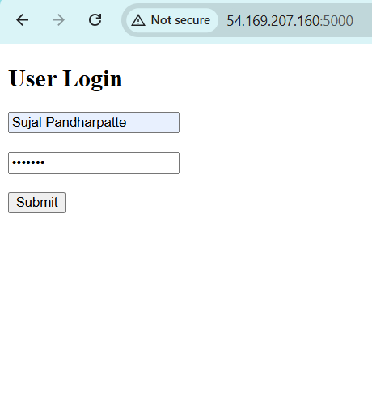
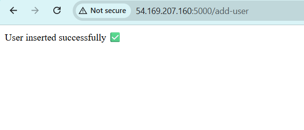
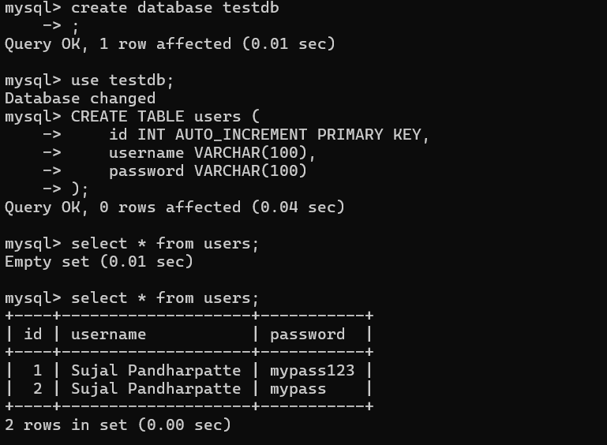

# 3-Tier AWS Application – Dockerized Deployment

## Candidate Name
Sujal Pandharpatte

## Role
AWS / DevOps Intern

---

## 📌 Project Description
This project demonstrates a **three-tier web application architecture** deployed using **Docker** on **AWS EC2**.  
The goal of this project is to showcase frontend, backend, and database separation along with containerization, scalability, and cost optimization.

The application is currently running and accessible at:  
👉 **http://54.169.207.160:5000/**

---

## 3-Tier Architecture Overview

### Tier 1 – Presentation Layer
- Nginx web server
- Serves static HTML frontend
- Accessible to users via HTTP

### Tier 2 – Application Layer
- Flask-based REST API
- Handles application logic
- Communicates with the database


### Tier 3 – Data Layer
- MySQL database
- Stores application data



## 📐 Architecture Flow (Logical)
```bash
User
│
▼
Application Load Balancer
│
▼
Auto Scaling Group
│
▼
EC2 Instance
├── Frontend Container (Nginx)
├── Backend Container (Flask API)
└── Database Container (MySQL)
```


---

## Technology 
- Frontend: HTML, Nginx
- Backend: Python (Flask)
- Database: MySQL
- Containerization: Docker, Docker Compose
- Cloud: AWS EC2, Application Load Balancer, Auto Scaling Group
- Operating System: Ubuntu 22.04

---

## Project Structure
```bash
Sujal-Pandharpatte/
├── frontend/
│ ├── index.html
├── backend/
│ ├── app.py
│ ├── requirements.txt
│ └── Dockerfile
├── docker-compose.yml
└── README.md
└── docs/images
```

---

## How to Run the Application (Local)

### Prerequisites
- Docker
- Docker Compose

### Steps
```bash
docker-compose up -d----for start container
docker-compose down----for stop container

## Deployment Steps (Short)

1. Launch an EC2 instance (Amazon Linux 2, t2.micro/t3.micro).
2. Configure Security Group:
   - SSH (22), HTTP (80), Application Port (5000).

3. Connect to the instance:

ssh -i your-key.pem ec2-user@<EC2_PUBLIC_IP>

## Install Docker

sudo yum update -y
sudo yum install docker -y
sudo systemctl start docker
sudo systemctl enable docker
sudo usermod -aG docker ec2-user

##  Install Docker Compose:

sudo curl -L https://github.com/docker/compose/releases/latest/download/docker-compose-$(uname -s)-$(uname -m) \
-o /usr/local/bin/docker-compose
sudo chmod +x /usr/local/bin/docker-compose

## Create application with:
Frontend (Nginx)
Backend (Python Flask)
Database (MySQL)

## Configure docker-compose.yml to connect frontend, backend, and MySQL.

## Start containers:

docker-compose up -d

## Access application using EC2 public IP:

http://54.169.207.160:5000/

## Configure Application Load Balancer and attach EC2 instances.

## Create Auto Scaling Group:

Min: 1
Desired: 1
Max: 2
Scaling based on CPU utilization.
```

## AWS Deployment (Summary)

EC2 instance launched using free-tier eligible type (t2.micro / t3.micro)
Docker and Docker Compose installed on EC2
Application deployed using Docker Compose
Application accessed via EC2 Public IP

## Load Balancer & Auto Scaling

Application Load Balancer used to distribute traffic
Auto Scaling Group configuration:
Minimum instances: 1
Desired instances: 1
Maximum instances: 2
Scaling based on CPU utilization

## Troubleshooting

# Application not accessible

Check EC2 security group rules
Verify containers are running
Confirm correct public IP and port

# Container running but port not reachable

Ensure Flask application listens on 0.0.0.0
Verify Docker port mappings

# Load Balancer health check issues

Verify health check path
Confirm target group port
Check security group settings

## Documentation

All supporting screenshots and architecture diagrams are available in the docs/ folder.

